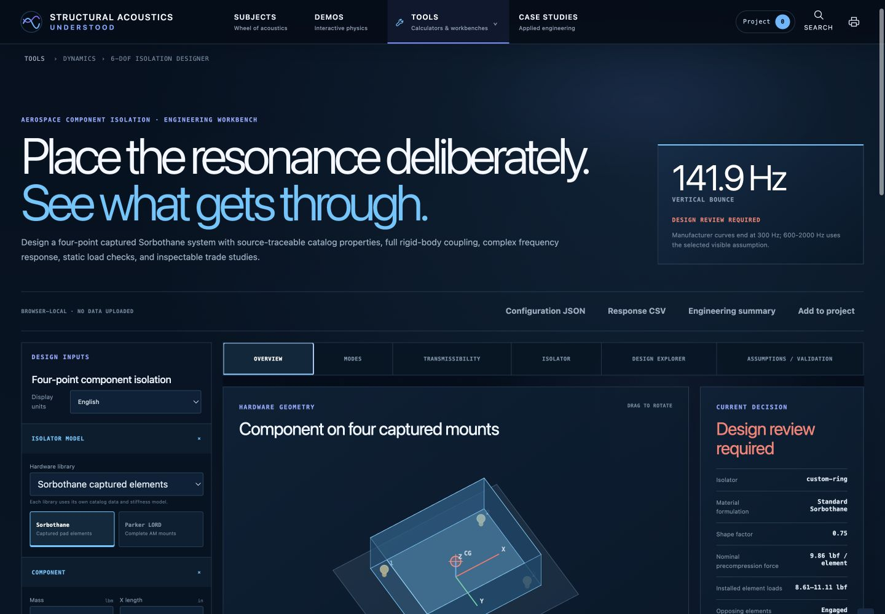
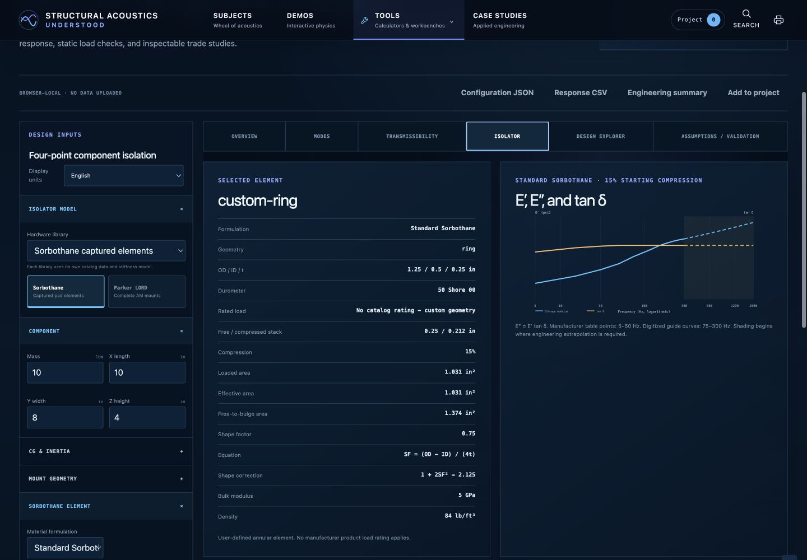
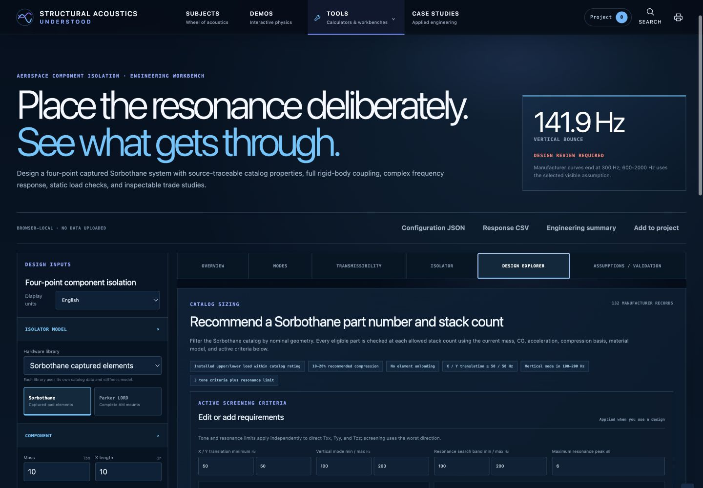
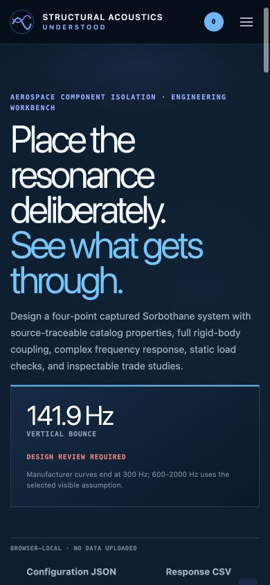
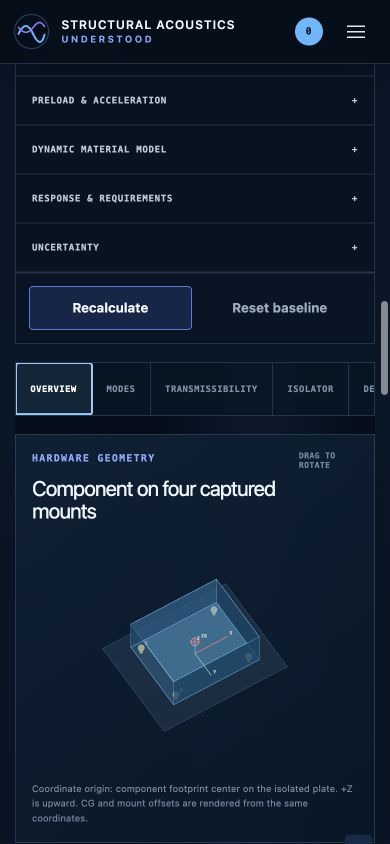

# Engineering Tool Design Guidelines

Status: Phase 1 reference standard

Reference implementation: `#/tool/sorbothane-isolation`

Audience: designers and agents extending Structural Acoustics, Understood

## Purpose

Use the Sorbothane 6-DOF Isolation Designer as the behavioral and visual reference for the site's engineering tools without copying its tool-specific code into every calculator.

The goal is one recognizable family of tools with three appropriate depths:

1. **Quick screen** for a focused calculation.
2. **Interactive analysis** for plots, comparisons, and physical exploration.
3. **Guided workbench** for persistent, multi-step engineering decisions.

The tools should feel related because they share a decision-centered information architecture, interaction contract, visual tokens, result language, and validation rules. They do not need identical tabs, diagrams, or control counts.

## Reference observations

### Decision before detail

The hero names the engineering decision in physical language, shows one controlling metric, exposes status, and states the most important model limitation before the user reaches the controls.

### Inputs and evidence remain connected

The desktop workbench keeps grouped inputs beside a hardware view, current decision, mode metrics, requirements, interpretation, and warnings. A changed input remains visibly connected to its physical consequence.

### Current hardware and design-space search are separate jobs

The Isolator view explains the selected element, installed arrangement, material behavior, and source basis. Hardware drawings belong here because they explain the current design.

Design Explorer is reserved for criteria, catalog screening, parametric sweeps, comparison, and recommendation. It should not become a second overview or duplicate the current hardware description.

### Responsive behavior preserves the engineering sequence

<table>
  <tr>
    <td></td>
    <td></td>
  </tr>
</table>

At narrow widths the hero, controls, navigation, and evidence stack in reading order. The physical view is still present; the mobile layout does not degrade into a values-only calculator.

## Non-negotiable principles

### 1. Start with the decision

Every tool must answer these questions above or at the top of its results:

- What engineering decision does this tool support?
- What is the controlling result right now?
- Is the result passing, review-required, incomplete, or still running?
- What limitation is most likely to change the decision?

Titles should use physical language such as “Place the resonance deliberately” or “Identify the controlling transmission path,” not implementation labels such as “Calculator 12.”

### 2. Teach the behavior, not only the equation

Numerical results must be paired with at least one of the following:

- A hardware or geometry view
- A mechanism diagram
- A response plot
- A comparison or trade-space map
- A short physical interpretation

The visual must respond to the same state used by the calculation. Decorative diagrams that do not reflect the inputs are not acceptable.

### 3. Organize by physical meaning

Group inputs according to the engineer's mental model: hardware, geometry, material, forcing, boundary conditions, response, criteria, and uncertainty. Do not organize fields by source-file order or solver function.

Advanced or rarely changed assumptions belong in collapsed groups. The inputs controlling the current decision remain open and nearby.

### 4. Keep current configuration and exploration distinct

- Put selected hardware, geometry, configuration drawings, and installed stack details with the current-component workflow.
- Put catalog screening, sweeps, optimization, ranked alternatives, and sensitivity maps in an explorer or study workflow.
- When an alternative is applied, retain its provenance and visibly identify it as the current design.
- Do not duplicate current-hardware drawings inside Design Explorer.

### 5. Make provenance visible at the point of use

Every important input or curve should be attributable to one of these categories:

1. Manufacturer or authoritative published value
2. Digitized source value
3. Interpolated value
4. Engineering assumption or extrapolation
5. Calculated value

An extrapolated region must be visually distinct on the plot and described in nearby text. Missing data must remain missing or explicitly assumed; it must not be silently invented.

### 6. Preserve engineering state

Interactive analyses and guided workbenches must use versioned, browser-local state. At minimum they provide:

- Automatic local persistence
- Reset to a documented baseline
- Export and import for reusable studies
- Add to Project or equivalent evidence capture
- A schema/version marker for future migrations

The currently selected view and hardware library should survive a normal rerender. Switching models must not expose controls or assumptions belonging to another model.

### 7. Put limitations beside conclusions

Warnings and validity checks must be driven by the current state. A generic disclaimer at the bottom of the page is not a substitute for an active warning beside a decision.

The shared `EngineeringResult` sections remain the minimum result contract:

- `values`
- `interpretation`
- `assumptions`
- `validity`
- `relatedConcepts`

Plots, heatmaps, tables, range charts, and downloadable data remain attached evidence rather than replacements for interpretation.

## Tool profiles

| Capability | Quick screen | Interactive analysis | Guided workbench |
| --- | --- | --- | --- |
| Intended use | Focused estimate or conversion | Explore physical behavior and alternatives | Carry a multi-step decision with evidence |
| Hero | Compact purpose and key limit | Decision statement and live metric | Decision statement, project/status panel, key limit |
| Inputs | One grouped form | Grouped inspector or sidebar | Persistent inspector plus workflow-specific fields |
| Navigation | Usually none | Optional tabs for distinct evidence | Required tabs or numbered workflow steps |
| Physical visual | When it materially aids interpretation | Required | Required |
| Evidence | Primary values plus plot/table as needed | Multiple coordinated views | Current-step evidence plus system-level review |
| Comparison | Optional | Baseline or curve comparison | Baseline, alternatives, and project history |
| Persistence | Optional for trivial tools | Required | Required with import/export |
| Explorer | No | Only when the tool actually performs a study | Optional, separate from current configuration |
| Trust layer | Assumptions, validity, references | Active warnings, provenance, validation | Active checks, provenance, validation plan, handoff/export |
| Quick route | This is the quick route | Preserve focused mode where useful | Preserve `?mode=quick` for component calculations |

Do not promote a quick screen to a guided workbench merely because the subject is advanced. Use a guided workbench only when the user must preserve a sequence of linked engineering decisions.

## Information architecture

Use this order unless the physics creates a stronger reason to change it:

1. **Orientation:** breadcrumb, decision title, short scope, controlling metric, status, key limitation.
2. **Actions:** unit system, copy/export, import, reset, add to project.
3. **Controls:** grouped inputs and model/library selection.
4. **Overview evidence:** physical view, current design, primary metrics, requirements.
5. **Deep evidence:** plots, modes, tables, comparisons, sensitivity, uncertainty.
6. **Component or hardware view:** selected record, geometry, source data, installed arrangement.
7. **Study view:** catalog screen, sweep, ranked alternatives, applied candidate.
8. **Trust view:** equations, assumptions, limitations, provenance, verification, required testing.

Tabs describe engineering questions, not generic containers. Prefer “Modes,” “Transmission Paths,” or “Measurement Plan” over “Results 1,” “Results 2,” or “More.”

## Interaction rules

### Calculation behavior

- Recalculate live when the operation is fast enough to feel immediate and partial inputs can be handled safely.
- Use an explicit Run action for expensive sweeps, imports, Monte Carlo studies, or catalog searches.
- Long operations expose progress, current stage, cancellation, and a stable previous result until replacement is complete.
- Invalid inputs identify the exact field and preserve the last valid result where practical.
- Never imply that “no numerical warning” means “flight-ready” or “validated.”

### Selection and comparison

- The current item is visually distinct from hover, recommended, and merely feasible items.
- A recommendation states the criteria and ranking basis that produced it.
- Baseline comparison reports physical quantity, units, direction/sign, and secondary tradeoffs.
- Multi-curve plots provide explicit trace controls. The current or primary curve is selected initially; “show all” remains an intentional choice.

### Units

- Compute in one canonical internal unit system and convert at the interface boundary.
- Show units in field labels, metric cards, axes, tables, copied reports, and exports.
- A unit-system switch updates every visible value and control consistently.
- Never combine a converted value with an unconverted limit or axis.

### State and routing

- State schemas are versioned and normalized on load.
- Import validates the schema and tool identity before replacing current state.
- Reset describes what will be lost when the state is nontrivial.
- Preserve existing tool routes and the original focused calculation mode.
- Use query parameters for routable subviews when a link should be durable; do not overload document anchors that the application reserves for accessibility.

## Visual language

The implementation should reuse the existing site tokens and promote missing Sorbothane semantics into shared tokens. Do not copy `.sorbo-*` selectors into another tool.

### Base tokens

| Role | Existing token/value | Use |
| --- | --- | --- |
| Deep canvas | `--site-color-canvas-deep: #020d19` | Page background and visual depth |
| Canvas | `--site-color-canvas: #03101e` | Main engineering surface |
| Raised canvas | `--site-color-canvas-raised: #06172a` | Workbench region |
| Surface | `--site-color-surface` | Cards and panels |
| Solid surface | `--site-color-surface-solid: #0b2037` | Sticky controls and dense panels |
| Border | `--site-color-border` | Default panel separation |
| Text | `--site-color-text: #f3f7fc` | Primary labels and results |
| Muted text | `--site-color-muted: #a4b5ca` | Explanations and metadata |
| Interaction accent | `--site-color-cyan: #55b8ff` | Focus, active tab, primary trace |
| Secondary accents | `--site-color-blue`, `--site-color-violet` | Additional series and subject variation |

Promote shared semantic equivalents of the Sorbothane-only teal, amber, and red for pass, caution/assumption, and review/failure. Status colors must not be used as ordinary data-series colors in the same view.

### Typography and density

- Large display type is reserved for the engineering question and one controlling result.
- Uppercase monospace labels identify section type, units, provenance, and status.
- Body copy explains behavior in plain engineering language.
- Dense tables use monospace for values but retain readable headers and row spacing.
- Use the existing spacing scale (`--site-space-1` through `--site-space-8`) rather than tool-local arbitrary gaps.

### Cards and hierarchy

- Cards are flat engineering surfaces separated by borders and modest tonal changes.
- Reserve strong shadows, bright borders, or colored rails for active selection, status, or recommendation.
- A metric card contains one value, unit, physical label, status where applicable, and one concise secondary explanation.
- Do not create a wall of equal-weight cards. The controlling metric and current decision must remain visually dominant.

### Charts and diagrams

- Axes, units, scale type, and curve identity are always visible.
- Supported, measured, extrapolated, excluded, and selected regions have distinct encodings.
- Pass/fail criteria appear on the plot when they are part of the decision.
- Tooltips supplement rather than replace persistent labels.
- Hardware views identify coordinates, reference planes, force directions, or measurement points needed to interpret the model.
- Exaggerated animation is labeled as such and must never be presented as absolute displacement.

## Responsive and print behavior

Use the current Sorbothane breakpoints as reference behaviors, not immutable pixel values:

- **Wide desktop:** sticky input sidebar beside the evidence workspace.
- **Medium desktop/tablet:** controls and evidence may stack; sticky viewers become normal-flow content.
- **Mobile:** one-column reading order, horizontally scrollable tabs, compact metric grids, full-width actions.

Required behavior:

- No information is available only on hover.
- Sticky regions must not trap content or consume most of a small viewport.
- Tables and wide plots either reflow or receive an intentional horizontal-scroll container.
- The physical view remains visible at mobile width.
- Print hides input controls and interactive actions, expands all required evidence, uses a light background, and avoids splitting critical cards.

## Accessibility

- Use native labels and controls.
- Tabs implement `tablist`, `tab`, `tabpanel`, `aria-selected`, `aria-controls`, and keyboard movement.
- Selection controls expose `aria-pressed` or native checked state.
- Status is communicated with text and structure, not color alone.
- All interactive targets are at least 44 by 44 CSS pixels where space permits.
- Focus indicators use the shared interaction accent and remain visible on dark surfaces.
- SVGs have a useful accessible name and description; decorative geometry is hidden from the accessibility tree.
- Live calculation announcements are concise and do not fire on every keystroke when that would overwhelm assistive technology.

## Engineering trust requirements

Every tool must expose, in proportion to risk:

- Governing equations or method basis
- Assumptions satisfied by the current state
- Active warnings and invalidity conditions
- Source provenance and access/reference information
- Supported range and extrapolation policy
- Numerical or analytical verification cases
- What higher-fidelity analysis or test is required before consequential use

A catalog record is not an allowable. A screening model is not a qualification model. A nominal bit depth is not usable measurement dynamic range. The interface should make these distinctions difficult to overlook.

## Implementation boundary

The shared system should evolve the existing `js/workbench-runtime.js`, `js/site-components.js`, `js/engineering-results.js`, and site tokens in `styles.css`.

Rules for implementation:

- Add reusable renderers and contracts before migrating individual tools.
- Use adapters to connect existing calculators to the shared result and workbench contracts.
- Keep solver, catalog, and domain-specific visualization logic inside the tool module.
- Keep generic state, actions, tabs/workflow, evidence, warnings, and responsive styling in shared modules.
- Do not rewrite stable numerical models merely to adopt the design system.
- Do not hand-edit `standalone.html`; regenerate it after source changes.

See [COMPONENT-INVENTORY.md](COMPONENT-INVENTORY.md), [MIGRATION-MATRIX.md](MIGRATION-MATRIX.md), and [AGENT-HANDOFF.md](AGENT-HANDOFF.md) for implementation planning.

## Definition of done for a migrated tool

A migration is complete only when:

- The assigned profile is justified.
- The engineering decision and controlling result are visible.
- Inputs are grouped by physical meaning.
- The visual and numerical evidence use the same state.
- Interpretation, assumptions, validity, and provenance are present.
- Unit switching is internally consistent.
- Persistence and export behavior match the profile.
- Responsive, keyboard, and print behavior are verified.
- The focused quick route remains available where required.
- Automated tests, browser QA, standalone synchronization, and deterministic-build checks pass.
